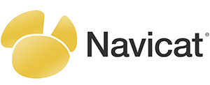

Architect
=========

.. image:: https://badge.fury.io/py/architect.svg
   :target: https://badge.fury.io/py/architect

.. image:: https://img.shields.io/travis/maxtepkeev/architect/master.svg
   :target: https://travis-ci.org/maxtepkeev/architect

.. image:: https://img.shields.io/coveralls/maxtepkeev/architect/master.svg
   :target: https://coveralls.io/r/maxtepkeev/architect?branch=master

Architect is a set of tools which enhances ORMs written in Python with more features and simplifies
different database related complex tasks.

Features
--------

* Supported ORMs

  - `Django <https://www.djangoproject.com>`_ >= 1.4
  - `Peewee <https://peewee.readthedocs.org>`_ >= 2.2.0
  - `Pony <http://ponyorm.com>`_ >= 0.5.0
  - `SQLAlchemy <http://www.sqlalchemy.org>`_ >= 0.8.0
  - `SQLObject <http://www.sqlobject.org>`_ >= 1.5.0

* Supported DBs

  - `PostgreSQL <http://www.postgresql.org>`_ >= 8.0
  - `MySQL <https://www.mysql.com>`_ >= 5.5

* Supports Python 2.6 - 3.5
* Extensively documented

Dependencies
------------

Architect has no required external dependencies except for the ORM it will be used with.

Installation
------------

To install Architect, simply:

.. code-block:: bash

   $ pip install architect

or:

.. code-block:: bash

   $ easy_install architect

Documentation
-------------

Documentation is available at http://architect.readthedocs.org.

Contacts and Support
--------------------

I will be glad to get your `feedback <https://github.com/maxtepkeev/architect/issues>`_, `pull requests
<https://github.com/maxtepkeev/architect/pulls>`_, `issues <https://github.com/maxtepkeev/architect/issues>`_,
whatever. Feel free to contact me for any questions.

Donations and Sponsorship
-------------------------

If you like this project and want to support it you have 3 options:

#. Just give this project a star at the `GitHub <https://github.com/maxtepkeev/architect>`_ repository.
#. You can express your gratitude via `Gratipay <https://gratipay.com/maxtepkeev/>`_.
#. Become a sponsor. Contact me via ``tepkeev at gmail dot com`` if you are interested in becoming a sponsor
   and we will discuss the terms and conditions.

Thanks
------

PremiumSoft for supporting this project by providing `Open Source License
<http://www.navicat.com/store/open-source>`_ of `Navicat <http://www.navicat.com>`_.

Copyright and License
---------------------

Architect is licensed under Apache 2.0 license. Check the `LICENSE
<https://github.com/maxtepkeev/architect/blob/master/LICENSE>`_ for details.
